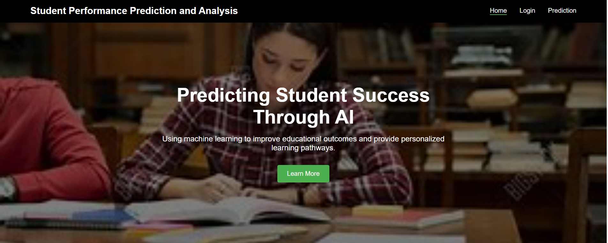

# Student Performance Prediction and Analysis


## Introduction
This project focuses on predicting and analyzing student performance using various factors. It provides insights into student data trends and helps in making informed decisions to improve academic outcomes.

## Features

1. **Predict Final Marks**  
   Provides predictions for students' final marks based on the input data.

2. **Identify Weak Subjects**  
   Highlights weak subjects using Z-score analysis to pinpoint areas needing improvement.

3. **Suggest Learning Resources**  
   Recommends personalized learning resources for weak subjects using the Gemini API.

4. **Data Visualization**  
   Offers interactive charts and graphs for better understanding and analysis of student performance.
   
## Dataset Information
The dataset used in this project includes the following attributes:

- **gender**: Student's gender.
- **age**: Student's age.
- **address**: Student's living location (urban/rural).
- **parent_education**: Highest education level of parents.
- **travel_time**: Home to school travel time.
- **study_time**: Weekly study hours.
- **failures**: Number of past class failures.
- **extra_classes**: Whether the student takes extra classes (yes/no).
- **extra_curricular**: Whether the student participates in extra-curricular activities (yes/no).
- **internet_access**: Whether the student has internet access at home (yes/no).
- **health**: Student's health status rating.
- **absences**: Number of school absences.
- **linear_algebra_mark**: Score in Linear Algebra course.
- **eng_mechanics_mark**: Score in Engineering Mechanics course.
- **basic_elec_mark**: Score in Basics of Electronics and Electrical Engineering course.

## Methodology

### 1. Predictive Model Development
- **Data Collection & Preprocessing**: The dataset includes both academic and non-academic factors. Data cleaning, handling missing values, and feature engineering are performed. Categorical variables are encoded using one-hot encoding.
- **Final Features**: The dataset is structured with encoded categorical variables and numerical features for better model performance.

### 2. Training the Machine Learning Model
- **Random Forest Algorithm**: A Random Forest Regression model is trained using bootstrap sampling and feature sampling. The final prediction is obtained through aggregation, providing accurate and stable results.

### 3. Weak Subject Identification & Resource Recommendation
- **Weak Subject Identification**: Z-score analysis identifies weak subjects based on predicted marks. A predefined Z-score threshold is used for classification.
- **Resource Recommendation**: The Gemini API generates subject-specific resources like online courses, books, YouTube videos, and study techniques. Results are formatted in HTML for integration.

### 4. Web Application Development
- **Backend**: Built using Flask, with a Random Forest model for predictions and MySQL for data storage.
- **Frontend**: Developed with HTML, CSS, and JavaScript, it displays predictions and integrates resource recommendations.

### 5. Routes and Functionalities
- **Home Route**: Renders the homepage.
- **Login & Register Routes**: Handles user authentication and registration securely.
- **Prediction Route**: Processes student data and predicts performance.
- **Result Route**: Displays structured prediction results, including weak subjects.
- **Generate Resources Route**: Provides personalized learning resources via the Gemini API.
- **Charts Route**: Displays interactive visualizations of student performance data.

## Installation

### Prerequisites
- Python 3.x installed on your local machine.
- Necessary Python libraries (specified in `requirements.txt`).

### Steps
1. Clone the repository:
   ```bash
   git clone https://github.com/Athirakadavath/student-performance-prediction-and-analysis.git
   ```
2. Navigate to the project directory:
   ```bash
   cd student-performance-prediction-and-analysis
   ```
3. Install dependencies:
   ```bash
   pip install -r requirements.txt
   ```

## Usage
1. Prepare the dataset and ensure it is in the correct format.
2. Run the Python scripts to process the data and generate predictions.
3. View the results and analysis through the generated outputs.

## Technologies Used
- **HTML**
- **CSS**
- **Javascript**
- **Python**
- **Flask**

## Demo Video
[](https://youtu.be/5CVn9qJ1kPA)

 
## Contact Information
For any queries or suggestions, feel free to reach out:
- **Owner**: ArchaKrishnanNR 
- **GitHub Profile**: [ArchaKrishnanNR](https://github.com/ArchaKrishnanNR)
